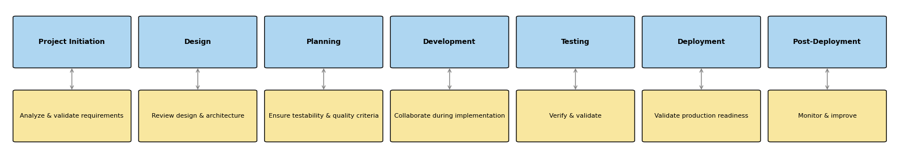

## Einleitung

In der modernen Softwareentwicklung hat sich **Quality Assurance (QA)** zu einer
strategischen Disziplin entwickelt, die den gesamten Softwarelebenszyklus
durchdringt von den ersten Anforderungen bis zum Monitoring in der Produktion.
Die Zeiten, in denen QA eine späte Phase war, sind vorbei: Qualität muss von
Anfang an mitgedacht werden.

Spät entdeckte Fehler sind **exponentiell teurer** und störender. Trotzdem
unterschätzen viele Teams den Mehrwert einer frühzeitigen QA-Einbindung und
verpassen so Vorteile wie bessere Testbarkeit, Risikominimierung und klügere
Designentscheidungen. In schnelllebigen **DevOps- und Cloud-native-Umgebungen**
muss QA über das reine Testen hinausgehen und zum Treiber von
Engineering-Exzellenz werden.

Dieser Artikel zeigt, warum QA von Anfang an wichtig ist, räumt mit Mythen auf
und bietet praxisnahe Strategien von Testableitung über Automatisierung und
Chaos Engineering bis hin zur Zukunft KI-getriebener Tests.

---

## Warum QA ab Tag Eins?

QA bedeutet nicht nur Testen es geht darum, **Qualität von Beginn an
einzubauen**. Eine frühe Einbindung von QA-Engineers sorgt für:

- **Klarere Anforderungen**  
  QA beseitigt Unklarheiten und stellt sicher, dass Spezifikationen testbar
  sind.

- **Bessere Architektur und Design**  
  QA fördert wartbare, testbare Systeme mit Mustern wie Feature Flags, Canary
  Releases und Observability.

- **Risikofrüherkennung**  
  QA identifiziert frühzeitig Probleme bei Performance, Datenflüssen und
  Sicherheit.

- **Geringere Kosten**  
  Frühe Fehlererkennung reduziert Nacharbeiten, Testzyklen und
  Lieferverzögerungen mit hohem ROI (Return on Investment).

> 

---

## Häufige Missverständnisse über QA

### QA ist nur Testen  

**Falsch**: QA umfasst Analyse, Planung, Risikobewertung und kontinuierliche
Verbesserung.

### QA am Ende reicht aus  

**Falsch**: Späte Fehlerbehebung ist langsamer und teurer. Qualität muss **früh
eingebaut** werden.

### QA braucht keine technischen Fähigkeiten  

**Falsch**: Moderne QA-Engineers müssen Code, APIs, CI/CD und Systemarchitektur
verstehen.

### QA ist ein Kostenfaktor  

**Falsch**: QA verhindert teure Fehler, beschleunigt die Lieferung und
verbessert die Kundenzufriedenheit.

---

## Technische Kompetenz als Erfolgsfaktor für QA



<button class="btn" onclick="openDialog('qa-skills').showModal()" style="width: 50%; display: block; margin: 0 auto;"> Moderne QA Engineers: Fähigkeiten und Werkzeuge </button> <!-- markdownlint-disable MD013 -->

<dialog id="qa-skills" onmousedown="event.target==this && this.close()">
  <button class="close-btn" onclick="closeDialog('qa-skills').close()">×</button>
  <h3>Senior Software QA Engineer Fähigkeiten (2025, 5+ Jahre Erfahrung)</h3>
  <ul>
    <li><strong>Testfalldesign & -management</strong> 
      Erfahren im Entwurf klarer, umfassender und wiederverwendbarer Testfälle basierend auf Anforderungen und User Stories,
      mit praktischer Erfahrung in Testfall-Management-Tools wie TestRail, Jira Xray.
    </li> 
    <li><strong>Testautomatisierungsfähigkeiten</strong> 
      Fähigkeit, automatisierte Tests zu entwerfen,
      zu entwickeln und zu warten, um die Testabdeckung und Effizienz zu verbessern.
    </li> 
    <li><strong>CI/CD Kenntnisse</strong> 
      Verständnis von Continuous Integration und Continuous Deployment Pipelines, um Tests in Entwicklungsabläufe
      zu integrieren.
    </li> 
    <li><strong>Programmierkenntnisse</strong> 
      Fähigkeit, Code für Testautomatisierung, Debugging und Skripterstellung
      zu schreiben und zu verstehen (z. B. Java, Python, JavaScript, Bash usw.).
    </li> 
    <li><strong>Werkzeugkompetenz</strong> 
      Praktische Erfahrung mit modernen Testwerkzeugen und Frameworks für Web-, Mobile- und API-Tests
      (z. B. Selenium, Appium, Postman usw.).
    </li> 
    <li><strong>Cloud-native Tests</strong> 
      Vertrautheit mit Tests in cloud-nativen Umgebungen, einschließlich Microservices und serverlosen Architekturen.
    </li> 
    <li><strong>Agile & DevOps Kenntnisse</strong> 
      Sicheres Arbeiten in agilen Teams und Ausrichtung von Teststrategien auf DevOps-Praktiken.
    </li> 
    <li><strong>Sicherheitstests</strong> 
      Fähigkeit, Schwachstellen zu erkennen und
      sicherheitsrelevante Aspekte von Anwendungen zu testen (z. B. Authentifizierung, Autorisierung, Datenschutz).
    </li> 
    <li><strong>Leistungstests</strong> 
      Fähigkeiten zur Bewertung der Anwendungsleistung unter verschiedenen Bedingungen mit Tools wie JMeter, k6
      oder Gatling (z. B. Lasttests, Chaos-Tests usw.).
    </li> 
    <li><strong>Integration von KI & maschinellem Lernen</strong> 
      Grundverständnis dafür, wie KI/ML-Funktionen das Testen beeinflussen, und Kenntnis von Tools, die KI
      zur Testautomatisierung nutzen.
    </li> 
    <li><strong>Soft Skills</strong> 
      Ausgeprägte zwischenmenschliche Fähigkeiten, um effektiv mit Entwicklern, Produktmanagern und
      anderen Stakeholdern zusammenzuarbeiten (z. B. Kommunikation, Zusammenarbeit und Problemlösung).
    </li> 
  </ul>
</dialog>

### Die Rolle hat sich gewandelt

Moderne QA-Engineers sind **technische Mitgestalter**, versiert in:

- Programmierung und Scripting
- Datenbanken, APIs und Infrastruktur
- CI/CD-Pipelines und Container-Orchestrierung

Sie schlagen die Brücke zwischen Entwicklung und QA, verbessern die
Kommunikation und liefern **hochwertige, umsetzbare Bug Reports**.

### Zusammenarbeit verbessert Ergebnisse

Wenn QA früh eingebunden wird:

- Verstehen Entwickler und QA gemeinsam Ziele und Randfälle
- Unterstützt QA das Design für Testbarkeit und Observability
- Fehler werden schneller behoben, die Team-Motivation steigt

Organisationen, die in kompetente QA-Engineers investieren, profitieren von:

- Robusteren Systemen
- Schnelleren Entwicklungszyklen
- Höherer Produktqualität

---

## Effektive Teststrategien

### Über das Anforderungs-basierte Testen hinaus

Anforderungen sind oft veraltet oder entsprechen nicht den Nutzererwartungen.
Stattdessen sollte QA Tests auf Basis von **Akzeptanzkriterien** und **realem
Nutzerverhalten** ableiten.

> *„Wir haben das getestet, was wir spezifiziert hatten nicht das, was die
> Nutzer wirklich brauchten.“*

### Best Practices zur Testableitung

- Verwende das **Given-When-Then**-Format für Klarheit und Automatisierung
- Decke Happy Paths und Randfälle ab
- Integriere nicht-funktionale Tests (z. B. Performance, Sicherheit)
- Arbeite mit Entwicklern bei der Testgestaltung zusammen

> *„Ein 30-minütiges Gespräch kann Tage an Bugfixing sparen.“*

### Testdokumentation mit Maß

- **Kritische Pfade**: Vollständig dokumentiert
- **Kernfunktionen**: Mittleres Detailniveau
- **Randfälle**: Explorativ oder durch Intention beschrieben

---

## Automatisierung und CI/CD Best Practices

### Strategische Automatisierung

Nicht alles sollte automatisiert werden. Fokus auf:

- Hochwertige Regressionstests
- Stabile APIs und Kernlogik
- Wiederholbare oder fehleranfällige Abläufe

Vermeide Überautomatisierung bei schnell ändernden UIs oder wenig relevanten
Flows.

### Integrierte CI/CD-Pipelines

Automatisierung ist am effektivsten, wenn in CI/CD integriert:

- **Unittests**: Schnelles Feedback bei Commits / Pull Requests
- **Integrations- und API-Tests**: Validierung nach Merge
- **UI-, Sicherheits- und Performancetests**: Selektiv und periodisch ausführen

### Shift-Left und Shift-Right Testing

- **Shift-Left**: Frühes Testen mit TDD, BDD und statischer Analyse
- **Shift-Right**: Verhalten in Produktion überwachen mit Canary Releases und
  Observability

### Smarte Regressionstests

- Priorisiere nach Risiko und jüngsten Änderungen
- Führe Tests parallel aus
- Entferne veraltete oder instabile Tests

---

## QA erweitern mit Chaos Engineering

**Chaos Engineering** erzeugt absichtlich Fehler, um die Resilienz eines Systems
zu testen besonders wertvoll bei **Microservices und
Cloud-native-Architekturen**.

### Warum es wichtig ist

- Deckt versteckte Abhängigkeiten und Kaskadeneffekte auf
- Testet **realistische Ausfallszenarien**, Selbstheilung und Monitoring
- Unterstützt Recovery- und Betriebsplanung

### Chaos in der Praxis

- Injektion von Latenz, gezieltes Beenden von Services, Netzwerkausfälle
  simulieren
- Auswirkungen beobachten und Wiederherstellungsmechanismen verbessern

**Skalierungstipps**:

- **Enterprise**: Automatisiere Chaos-Tests mit Tools wie Gremlin oder Chaos
  Monkey
- **Mittlere Teams**: Fokus auf kritische Services
- **Kleine Teams**: Manuelle Chaos „Game Days“ durchführen

**Voraussetzung**: Gute Observability ist essentiell für sichere Experimente.

---

## Die Zukunft von QA: KI und selbstheilende Systeme

KI revolutioniert QA durch bessere Testgenerierung, geringeren Wartungsaufwand
und Risikovorhersage.

### KI-gestütztes Testen

- Tests generieren aus Code, Anforderungen oder Nutzerverhalten
- Visuelles Testen, autonome Exploration und Differenzvergleiche

### Selbstheilende Automatisierung

- Passt sich automatisch an UI- oder API-Änderungen an
- Repariert oder markiert fehlerhafte Tests mittels Machine Learning
- Spart bis zu 70 % Wartungsaufwand
- Tools wie [browser-use](https://www.browser-use.com) zeigen adaptive
  Testansätze

### Prädiktive Qualitätsanalyse

- Testdaten, Codeänderungen und Defekthistorie analysieren
- Risikoänderungen vorhersagen und Tests priorisieren

### Das Mensch-KI-Team

KI bietet Geschwindigkeit und Abdeckung, **Menschen liefern Kreativität,
Intuition und ethisches Urteilsvermögen**.

> **Die Gewinnerformel für QA: Menschliche Strategie + KI-Effizienz**

---

## Fazit

Qualitätssicherung ist kein isolierter Schritt mehr sie ist ein strategischer
Erfolgsfaktor für moderne Software. Frühzeitig eingebundene QA sorgt für bessere
Anforderungen, stärkere Architektur, schnellere Rückmeldung und resiliente
Systeme.

Moderne QA ist **technisch, kollaborativ und zukunftsorientiert**, nutzt
Automatisierung, Chaos Engineering und KI, um heutigen Anforderungen gerecht zu
werden.

Unternehmen, die QA früh priorisieren, in Talente investieren und Qualität mit
Geschäftszielen verknüpfen, liefern nicht nur schneller sondern **besser**.

> „Qualität ist keine Handlung, sondern eine Gewohnheit.“ Aristoteles
