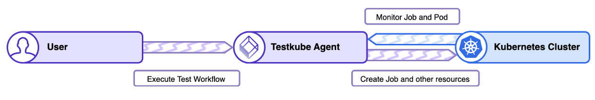
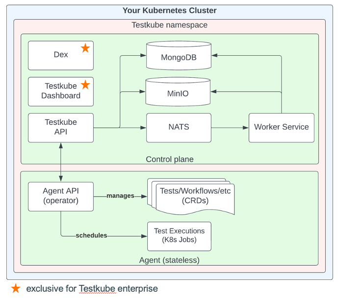

## **Was ist Testkube?**

Testkube ist ein **Test-Orchestrierungs- und Ausführungsframework** für
cloud-native Anwendungen. Es bietet eine einheitliche Plattform zum Ausführen
von Tests und integriert sich nahtlos mit Kubernetes und bestehenden
CI/CD-Pipelines. Testkube besteht aus zwei Hauptkomponenten:

- **Control Plane**: Verwalten der Testausführung, Berichterstattung und
  Orchestrierung. Kann in der Cloud oder On-Premises ausgeführt werden.
- **Agents**: Führen Tests in Ihrer Infrastruktur aus und sind zu 100 %
  Open-Source. Sie können auch eigenständig ohne den Control Plane betrieben
  werden.  
**Lizenzierung**:  
Testkube ist unter zwei Lizenzen verfügbar:
- **MIT License**: Open-Source und kostenlos.
- **Testkube Community License (TCL)**: Deckt zusätzliche
  Enterprise-Funktionalitäten ab.

---

## **Wichtige Funktionen**

1. **Test Workflows** (Primäre Custom Resource Definition - CRD)
   - Ersetzt die älteren CRDs (Test, TestSuite und Executor).
   - Verwalten des gesamten Lebenszyklus von Tests in Kubernetes.
   - Unterstützt mehrere Test-Tool-Versionen und Abhängigkeiten.
   - Ermöglicht die Definition mehrerer Ausführungsschritte mit
     Setup-/Teardown-Prozessen.
   - Konfiguriert tool-spezifische Befehle und Argumente.
   - Bietet eine bessere Ressourcenverwaltung und Testkontrolle.

2. **Kubernetes-Native Ausführung**
   - Analysiert die erwarteten Operationen und Bilder, um die erforderlichen
     Kubernetes-Ressourcen (ConfigMaps, Secrets, Jobs und Pods) zu erstellen.
   - Löscht automatisch erstellte Ressourcen nach der Testausführung.
   - Komponenten:
     - **Job**: Plant die Testausführung.
     - **Pod**: Führt die angeforderten Operationen aus und gibt Logs zurück.

3. **Enterprise-Funktionen**
   - Exklusiv für Testkube Enterprise-Nutzer.
   - Erweiterte Orchestrierungs- und Management-Funktionalitäten.

4. **Zentralisierte Berichterstattung und Analyse**
   - Bietet ein Dashboard zur Verwaltung von Testausführungen, Logs und
     Artefakten.
   - Unterstützt erweiterte Analysen für fundierte Entscheidungen.

---

## **Testkube Test-Workflow**

Test Workflows sind die primäre Custom Resource Definition (CRD) in Testkube und
ersetzen die älteren CRDs (Test, TestSuite und Executor). Sie verwalten den
gesamten Lebenszyklus von Tests in Kubernetes und bieten mehrere
Schlüsselmerkmale:

- **Ausführen von Tests**: Unterstützt verschiedene Test-Tool-Versionen und
  Abhängigkeiten.
- **Mehrere Ausführungsschritte**: Ermöglicht die Definition mehrerer Schritte
  für die Testausführung, einschließlich Setup- und Teardown-Prozessen.
- **Erweiterte Kontrolle**: Bietet mehr Kontrolle über die Testausführung,
  einschließlich Ressourcenverbrauch und Setup-/Teardown-Prozessen.
- **Tool-spezifische Befehle**: Ermöglicht die Konfiguration von
  tool-spezifischen Befehlen und Argumenten.



Test Workflows analysieren die erwarteten Operationen und Bilder und erstellen
alle erforderlichen nativen Kubernetes-Ressourcen wie ConfigMaps und Secrets für
Daten und, am wichtigsten, Jobs und Pods für die tatsächliche Ausführung.  
Nach der Ausführung des Test Workflows werden alle erstellten Ressourcen aus dem
Kubernetes-Cluster gelöscht.

- Komponenten:
  - **Job**: Für jede Ausführung wird ein Job erstellt, um den tatsächlichen
    Ausführungs-Pod zu planen.
  - **Pod**: Basierend auf dem Test Workflow wird ein Pod erstellt, um alle
    angeforderten Operationen auszuführen und alle Informationen in seinen Logs
    zurückzugeben.  

Beispiel eines Test Workflows für das Ausführen von Postman-Tests:

```yaml
kind: TestWorkflow
apiVersion: testworkflows.testkube.io/v1
metadata:
  name: postman-sample
  namespace: testkube
  labels:
    docs: example
content:
  git:
    uri: https://github.com/kubeshop/testkube
    revision: main
    paths:
      - test/postman/executor-tests/postman-executor-smoke-without-envs-postman_collection.json
container:
  workingDir: /data/repo/test/postman/executor-tests
resources:
  requests:
    cpu: 256m
    memory: 128Mi
steps:
  - name: Run test
    run:
      image: postman/newman:6-alpine
      args:
        - run
        - postman-executor-smoke-without-envs.postman_collection.json
```

## **Testkube Architektur**

  
Testkube besteht aus zwei Hauptkomponenten:

- **Testkube Agent**  
  Läuft im Cluster und verwaltet Testkube-Ressourcen, führt Tests aus, sammelt
  Ergebnisse usw.  
  Helm Chart: [helm-charts](https://kubeshop.github.io/helm-charts)

- **Testkube Server** (Control Plane)  
  Beinhaltet das Testkube Dashboard, Speicher für Ergebnisse/Artefakte,
  Cluster-Föderation usw.  
  Helm Chart:
  [testkube-cloud-charts](https://kubeshop.github.io/testkube-cloud-charts)

Zusätzliche Komponenten sind:

- **Dex**: Identitätsanbieter
- **MinIO**: Storage-Backend für Artefakte
- **NATS**: Message Broker für die Kommunikation zwischen API und Agents
- **MongoDB**: Datenbank zum Speichern aller Daten (Logs, Testergebnisse …)

PS: Der Testkube Agent und der Testkube Server können in verschiedenen Clustern
bereitgestellt werden.

---

## **Tests in Testkube auslösen**

Test Workflows können über mehrere Mechanismen ausgelöst werden:

1. **Manuelle Ausführung**
   - Tests können direkt über das Testkube Dashboard ausgelöst werden.
2. **Kubernetes Event-basierte Auslöser**
   - Automatisiert Test Workflows basierend auf Kubernetes-Ressourcenereignissen
     (z. B. Deployment-Updates, Ingress-Löschungen).
   - Verwendet Selektoren (nameRegex, labelSelector) und Bedingungen (z. B.
     Progressing, Available) zum Definieren von Auslösern.
3. **CLI-Ausführung**
   - Befehle zum Auslösen von Tests:
     - **Kostenlose Version**: `testkube set context --kubeconfig`
     - **Pro-Version**: `testkube set context --org-id $TESTKUBE_ORG_ID --env-id
       $TESTKUBE_ENV_ID -c cloud --root-domain test.bare.pandrosion.org
       --api-prefix testkube-api -k $TESTKUBE_API_TOKEN`
     - Test ausführen: `testkube run <resource_type> <resource_name>`
4. **API-Ausführung**
   - Tests können mit einer POST-Anfrage an die Testkube Agent API ausgelöst
     werden:

     ```
     POST https://testkube-api.test.bare.pandrosion.org/organizations/$TESTKUBE_ORG_ID/environments/$TESTKUBE_ENV_ID/agent/test-workflows/$TEST/executions
     ```

   - Autorisierung: Bearer Token (generiert im Testkube Dashboard).
   - Erforderliche Variablen werden in Vault unter `testkube-cloud` gespeichert.

---

## **Anwendungsfälle**

1. **Last- und Leistungstests**
   - Unterstützt Tools wie K6, JMeter und Gatling für verteilte Lasttests.
2. **End-to-End (E2E) Tests**
   - Führen Sie E2E-Tests mit Frameworks wie Playwright, Cypress und Selenium
     durch.
3. **API-Tests**
   - Integrieren Sie Postman, SoapUI und REST Assured in API-Test-Workflows.
4. **Hardwaretests**
   - Testen Sie Hardwarekomponenten wie GPUs in Kubernetes-Clustern mithilfe von
     Testkubes TestWorkflows.
5. **Python-Tests mit Pytest**
   - Erleichtert die Integration von Pytest in Kubernetes und ermöglicht
     skalierbare und effiziente Test-Workflows.

---

## **Fazit**

Testkube ist ein Wendepunkt für cloud-native Tests und bietet eine skalierbare,
flexible und vendor-unabhängige Plattform zum Ausführen von Tests in
Kubernetes-Umgebungen. Egal, ob Sie Entwickler, Tester oder DevOps-Ingenieur
sind, Testkube ermöglicht es Ihnen, hochwertige Software mit Vertrauen
bereitzustellen.  
Für weitere Informationen besuchen Sie die [Testkube
Dokumentation](https://docs.testkube.io/) oder lesen Sie den [Testkube
Blog](https://testkube.io/blog) für die neuesten Updates und Tutorials.
