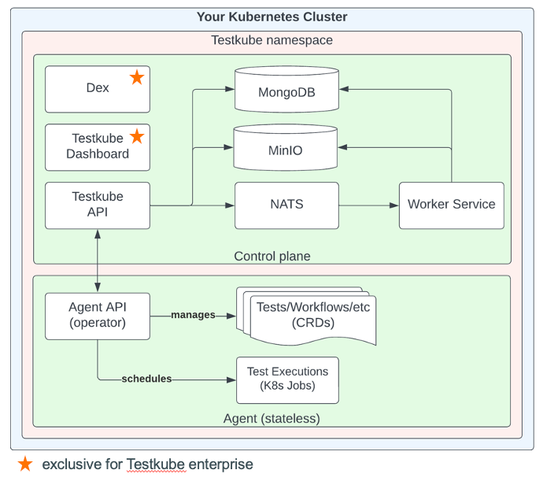

## **What is Testkube?**

Testkube is a **Test Orchestration and Execution Framework** for cloud-native applications. It provides a unified
platform for running tests, integrating seamlessly with Kubernetes and existing CI/CD pipelines. Testkube consists of
two main components:

- **Control Plane**: Manages test execution, reporting, and orchestration. It can run in the cloud or on-premises.
- **Agents**: Execute tests in your infrastructure and are 100% open source. They can also operate standalone without
the Control Plane.
**Licensing**:\
Testkube is available under two licenses:
- **MIT License**: Open-source and free to use.
- **Testkube Community License (TCL)**: Covers additional enterprise functionalities.

---

## **Key Features**

1. **Test Workflows** (Primary Custom Resource Definition - CRD)
   - Replaces the older CRDs (Test, TestSuite, and Executor).
   - Manages the full lifecycle of tests in Kubernetes.
   - Supports multiple testing tool versions and dependencies.
   - Allows defining multiple execution steps with setup/teardown processes.
   - Configures tool-specific commands and arguments.
   - Provides better resource management and test control.
2. **Kubernetes-Native Execution**
   - Analyzes expected operations and images to build required Kubernetes resources (ConfigMaps, Secrets, Jobs, and
Pods).
   - Automatically deletes created resources after test execution.
   - Components:
     - **Job**: Schedules test execution.
     - **Pod**: Executes requested operations and returns logs.
3. **Enterprise Features**
   - Exclusive for Testkube Enterprise users.
   - Enhanced orchestration and management capabilities.
4. **Centralized Reporting and Analysis**
   - Provides a dashboard to manage test executions, logs, and artifacts.
   - Supports advanced analytics for informed decision-making.

---

## **Testkube Test Workflow**

Test Workflows are the primary Custom Resource Definition (CRD) in Testkube, replacing the older CRDs (Test, TestSuite,
and Executor). They manage the full lifecycle of tests in Kubernetes, offering several key features:

- **Running Tests**: Supports different testing tool versions and dependencies.
- **Multiple Execution Steps**: Allows defining multiple steps for test execution, including setup and teardown
processes.
- **Enhanced Control**: Provides more control over test execution, including resource consumption and setup/teardown
processes.
- **Tool-Specific Commands**: Enables configuration of tool-specific commands and arguments.


Test Workflows analyze the expected operations and images, and build all the required native Kubernetes resources, such
as ConfigMaps and Secrets for data, and most importantly, Jobs and Pods for the actual execution.
After the Test Workflow execution is finished, all the created resources are deleted from the Kubernetes cluster.

- Components:
  - **Job**: For every execution, a Job is created to schedule the actual execution pod.
  - **Pod**: Based on the Test Workflow, a Pod is built to execute all the requested operations and return all the
information within its logs.
Example of a Test Workflow for running Postman tests:

```yaml
kind: TestWorkflow
apiVersion: testworkflows.testkube.io/v1
metadata:
  name: postman-sample
  namespace: testkube
  labels:
    docs: example
content:
  git:
    uri: https://github.com/kubeshop/testkube
    revision: main
    paths:
      - test/postman/executor-tests/postman-executor-smoke-without-envs-postman_collection.json
container:
  workingDir: /data/repo/test/postman/executor-tests
resources:
  requests:
    cpu: 256m
    memory: 128Mi
steps:
  - name: Run test
    run:
      image: postman/newman:6-alpine
      args:
        - run
        - postman-executor-smoke-without-envs.postman_collection.json
```

## **Testkube Architecture**


Testkube consists of two main components:

- Testkube Agent
   running in cluster that manages Testkube resources, runs tests, gathers results, etc.
   Helm Chart: [helm-charts](https://kubeshop.github.io/helm-charts)
- Testkube Server (Control plane)
   includes the Testkube Dashboard, Storage for Results/Artifacts, Cluster Federation, etc
   Helm Chart: [testkube-cloud-charts](https://kubeshop.github.io/testkube-cloud-charts)
Additional components are:
- Dex: identity provider
- MinIO: storage backend for storing artifacts
- NATS: message broker for communication between API and Agents
- MongoDB: database for storing all the data (logs, test results …)
PS: The testkube agent and testkube server can be deployed in different clusters

---

## **Triggering Tests in Testkube**

Test workflows can be triggered through multiple mechanisms:

1. **Manual Execution**
   - Tests can be triggered directly from the Testkube Dashboard.
2. **Kubernetes Event-Based Triggers**
   - Automates Test Workflows based on Kubernetes resource events (e.g., Deployment updates, Ingress deletions).
   - Uses selectors (nameRegex, labelSelector) and conditions (e.g., Progressing, Available) to define triggers.
3. **CLI Execution**
   - Commands to trigger tests:
     - **Free version**: `testkube set context --kubeconfig`
     - **Pro version**: `testkube set context --org-id $TESTKUBE_ORG_ID --env-id $TESTKUBE_ENV_ID -c cloud --root-domain
test.bare.pandrosion.org --api-prefix testkube-api -k $TESTKUBE_API_TOKEN`
     - Running a test: `testkube run <resource_type> <resource_name>`
4. **API Execution**
   - Tests can be triggered using a POST request to the Testkube Agent API:

     ```
     POST https://testkube-

api.test.bare.pandrosion.org/organizations/$TESTKUBE_ORG_ID/environments/$TESTKUBE_ENV_ID/agent/test-
workflows/$TEST/executions
     ```

- Authorization: Bearer Token (generated in Testkube Dashboard).
- Required variables stored in Vault under: `testkube-cloud`.

---

## **Use Cases**

1. **Load and Performance Testing**
   - Supports tools like K6, JMeter, and Gatling for distributed load testing.
2. **End-to-End (E2E) Testing**
   - Run E2E tests using frameworks like Playwright, Cypress, and Selenium.
3. **API Testing**
   - Integrate with Postman, SoapUI, and REST Assured for API testing workflows.
4. **Hardware Testing**
   - Test hardware components like GPUs in Kubernetes clusters using Testkube's TestWorkflows.
5. **Python Testing with Pytest**
   - Simplifies the integration of Pytest into Kubernetes, enabling scalable and efficient testing workflows.

---

## **Conclusion**

Testkube is a game-changer for cloud-native testing, offering a scalable, flexible, and vendor-agnostic platform for
running tests in Kubernetes environments. Whether you're a developer, tester, or DevOps engineer, Testkube empowers you
to deliver high-quality software with confidence.
For more information, visit the [Testkube Documentation](https://docs.testkube.io/) or explore the [Testkube
Blog](https://testkube.io/blog) for the latest updates and tutorials.
