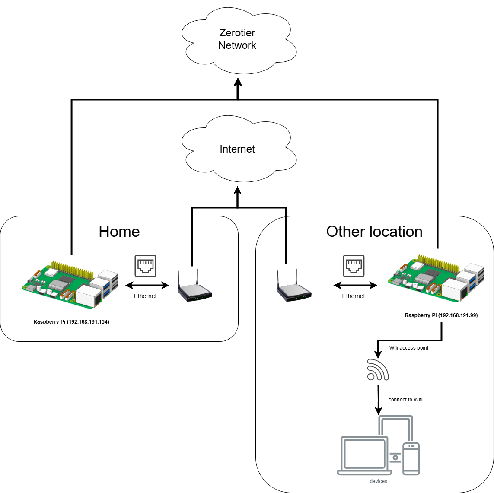

In diesem Tutorial führen wir Sie durch die Erstellung einer einfachen Lösung,
um den gesamten Verkehr über Ihr Heimnetzwerk zu leiten, indem Sie zwei
Raspberry Pi-Geräte und ZeroTier verwenden. Diese Einrichtung ermöglicht es
Ihnen, sich sicher mit Ihrem Heimnetzwerk von überall zu verbinden und den
gesamten Internetverkehr über Ihr Heimnetzwerk zu leiten, was eine zusätzliche
Sicherheitsschicht und Privatsphäre bietet. Sie erhalten auch die gleiche
IP-Adresse wie Ihr Heimnetzwerk von überall auf der Welt. ZeroTier ist ein
leistungsstarkes Tool, mit dem Sie sichere virtuelle Netzwerke erstellen können,
sodass Ihre Geräte so kommunizieren können, als wären sie im selben lokalen
Netzwerk, unabhängig von ihrem physischen Standort.

**Hinweis:** Dieses Tutorial ist inspiriert von der [DigitalOcean
Anleitung](https://www.digitalocean.com/community/tutorials/getting-started-software-defined-networking-creating-vpn-zerotier-one)
und der [harivemula
Anleitung](https://harivemula.com/2021/09/18/routing-all-traffic-through-home-with-zerotier-on-travel/).

## Voraussetzungen

Stellen Sie sicher, dass Sie die folgenden Voraussetzungen erfüllen, bevor wir
beginnen:

- Zwei Raspberry Pi-Geräte mit installiertem und aktualisiertem Raspberry Pi OS.
  (Ich habe für dieses Tutorial zwei Raspberry Pi 3 Geräte mit Raspberry Pi OS
  (64-bit, Kernel-Version: 6.6) verwendet.)
- Internetverbindung für beide Raspberry Pi-Geräte.
- Ein ZeroTier-Konto. Wenn Sie noch keines haben, können Sie es kostenlos bei
  [ZeroTier Central](https://my.zerotier.com/) erstellen.

## Übersicht der Architektur



## Schritt 1: Einrichten eines ZeroTier Netzwerks

### Erstellen Sie ein ZeroTier-Konto

1. Besuchen Sie [ZeroTier Central](https://my.zerotier.com/) und melden Sie sich
   für ein kostenloses Konto an.

### Erstellen Sie ein neues Netzwerk

1. Sobald Sie eingeloggt sind, klicken Sie auf "Create A Network."
2. Ein neues Netzwerk wird erstellt und Sie erhalten eine eindeutige
   Netzwerk-ID. Notieren Sie diese ID, da Sie sie später benötigen.

### Konfigurieren Sie das Netzwerk

1. Klicken Sie auf Ihr neu erstelltes Netzwerk, um auf die Einstellungen
   zuzugreifen.
2. Hier können Sie einen Namen für Ihr Netzwerk festlegen und andere
   Einstellungen nach Bedarf anpassen.
3. Stellen Sie sicher, dass "Private" unter "Access Control" ausgewählt ist, um
   Ihr Netzwerk sicher zu halten.

## Schritt 2: Installieren Sie ZeroTier auf den Raspberry Pi-Geräten

Führen Sie die folgenden Schritte auf beiden Raspberry Pi-Geräten durch.

### Installieren Sie die benötigten Pakete

1. Installieren Sie das ZeroTier-Repository und den GPG-Schlüssel:

   ```bash
   curl https://raw.githubusercontent.com/zerotier/ZeroTierOne/master/doc/contact%40zerotier.com.gpg | gpg --dearmor | sudo tee /usr/share/keyrings/zerotierone-archive-keyring.gpg >/dev/null
   ```

   ```bash
   RELEASE=$(lsb_release -cs)
   ```

   ```bash
   echo "deb [signed-by=/usr/share/keyrings/zerotierone-archive-keyring.gpg] http://download.zerotier.com/debian/$RELEASE $RELEASE main" | sudo tee /etc/apt/sources.list.d/zerotier.list
   ```

   ```bash
   sudo apt update
   sudo apt install -y zerotier-one
   ```

2. Überprüfen Sie die Installation:

   ```bash
   sudo zerotier-cli status
   ```

   Sie sollten eine Ausgabe sehen, die anzeigt, dass ZeroTier online ist.

3. Installieren Sie zusätzliche Pakete:

   ```bash
   sudo apt install dnsmasq hostapd iptables dhcpcd5
   ```

   dnsmasq: Ein leichtgewichtiger DNS- und DHCP-Server.

   iptables: Ein Tool zur Konfiguration der Linux-Kernel-Firewall.

   hostapd: Ein Daemon für Access Points und Authentifizierungsserver. (Nur für
   den Travel Raspberry Pi erforderlich, um einen Wi-Fi Access Point
   einzurichten.)

   dhcpcd5: Ein DHCP-Client- und Server-Daemon. (Nur für den Travel Raspberry Pi
   erforderlich, um eine statische IP-Adresse einzurichten.)

## Schritt 3: Treten Sie Ihrem ZeroTier Netzwerk bei

1. Führen Sie den folgenden Befehl auf jedem Raspberry Pi aus:

   ```bash
   sudo zerotier-cli join [Ihre_Netzwerk_ID]
   ```

   Ersetzen Sie `[Ihre_Netzwerk_ID]` durch die Netzwerk-ID, die Sie zuvor
   notiert haben.

2. Autorisieren Sie die Geräte:

   In ZeroTier Central, unter den Netzwerkeinstellungen, scrollen Sie zum
   Abschnitt "Members".

   Sie sollten die Raspberry Pi-Geräte als neue Geräte sehen. Aktivieren Sie das
   Kontrollkästchen "Auth?" neben jedem Gerät, um sie im Netzwerk zu
   autorisieren, und klicken Sie auf die Schaltfläche "Authorize".

   Sie können die Geräte auch umbenennen, um sie leichter identifizieren zu
   können.

3. Überprüfen Sie die Konnektivität:

   Auf jedem Raspberry Pi listen Sie die Netzwerke auf, um zu bestätigen, dass
   sie verbunden sind:

   ```bash
   sudo zerotier-cli listnetworks
   ```

   Sie sollten Ihr Netzwerk mit dem Status "OK" sehen.

## Schritt 4: Testen der VPN-Verbindung

1. Ermitteln Sie die ZeroTier-IP-Adressen: In ZeroTier Central, unter dem
   Abschnitt "Members", notieren Sie die verwalteten IP-Adressen, die jedem
   Raspberry Pi zugewiesen wurden. Wenn keine IP-Adresse automatisch zugewiesen
   wurde, können Sie eine manuell zuweisen. In diesem Tutorial verwenden wir die
   ZeroTier-IP-Adressen `192.168.191.99` für den Travel Raspberry Pi und
   `192.168.191.134` für den Home Raspberry Pi.

   

2. Testen der Konnektivität: Sie können sich mit dem ZeroTier-Client auf Ihrem
   lokalen Gerät mit dem gleichen Netzwerk verbinden und die Raspberry Pi-Geräte
   anpingen, um die Konnektivität zu überprüfen.

   ```bash
   ping [ZeroTier_IP_of_Raspberry_Pi]
   ```

   Sie sollten Antworten erhalten, was auf eine erfolgreiche VPN-Verbindung
   hinweist.

## Schritt 5: Konfigurieren Sie den Home Raspberry Pi

Um den Home Raspberry Pi so zu konfigurieren, dass der gesamte Verkehr über ihn
geleitet wird, folgen Sie diesen Schritten:

1. Aktivieren Sie das IP-Forwarding:

   - Öffnen Sie die sysctl-Konfigurationsdatei:

      ```bash
      sudo nano /etc/sysctl.conf
      ```

   - Kommentieren Sie die folgende Zeile aus oder fügen Sie sie hinzu, um
     IP-Forwarding zu aktivieren:

      ```plaintext
      net.ipv4.ip_forward=1
      net.ipv4.conf.all.rp_filter=2
      ```

   - Wenden Sie die Änderungen an:

      ```bash
      sudo sysctl -p
      ```

2. Konfigurieren Sie `dnsmasq`:

   - Öffnen Sie die `dnsmasq`-Konfigurationsdatei:

      ```bash
      sudo nano /etc/dnsmasq.conf
      ```

   - Fügen Sie die folgende Zeile hinzu, um den DNS-Server zu konfigurieren:

      ```plaintext
      server=192.168.1.1
      ```

3. Konfigurieren Sie `rc.local`:

   - Öffnen Sie die `rc.local`-Datei:

      ```bash
      sudo nano /etc/rc.local
      ```

   - Fügen Sie die folgenden Zeilen vor der Zeile `exit 0` hinzu, um dem
     ZeroTier-Netzwerk beizutreten und NAT einzurichten:

      ```plaintext
      sudo zerotier-cli join [Ihre_Netzwerk_ID]
      sudo iptables -t nat -A POSTROUTING -o eth0 -j MASQUERADE
      sudo iptables -A FORWARD -m conntrack --ctstate RELATED,ESTABLISHED -j ACCEPT
      sudo iptables -A FORWARD -i ztc3qulcfx -o eth0 -j ACCEPT
      ```

      PS: Der Home Raspberry Pi kann auch über Wi-Fi mit dem Internet verbunden
      sein. In diesem Fall ersetzen Sie `eth0` durch den Namen der
      Internetverbindung (z. B. `wlan0`).
   - Machen Sie die `rc.local`-Datei ausführbar:

      ```bash
      sudo chmod +x /etc/rc.local
      ```

4. Konfigurieren Sie die ZeroTier-Netzwerkeinstellungen:

   - Öffnen Sie die ZeroTier-Netzwerk-Konfigurationsdatei:

      ```bash
      sudo nano /var/lib/zerotier-one/networks.d/[Ihre_Netzwerk_ID].local.conf
      ```

   - Fügen Sie die folgenden Zeilen hinzu, um verwaltete Routen und globalen
     Verkehr zuzulassen:

      ```plaintext
      allowManaged=1
      allowGlobal=1
      allowDefault=1
      allowDNS=0
      ```

5. Starten Sie den Raspberry Pi neu:

   - Starten Sie den Raspberry Pi neu, um alle Änderungen anzuwenden:

      ```bash
      sudo reboot
      ```

## Schritt 6: Konfigurieren Sie den Travel Raspberry Pi

Dieser Raspberry Pi sollte über Ethernet mit dem Internet verbunden sein und als
Wi-Fi Access Point für andere Geräte fungieren. Der gesamte Verkehr von den
Wi-Fi-Clients wird über das ZeroTier-Netzwerk und den Home Raspberry Pi
geleitet. PS: Wenn Sie den Travel Raspberry Pi über Wi-Fi mit dem Internet
verbinden möchten, benötigen Sie einen zusätzlichen USB-Wi-Fi-Adapter. (Nicht in
diesem Tutorial behandelt.) Um den Travel Raspberry Pi zu konfigurieren, folgen
Sie diesen Schritten:


1. Statische IP-Adresse konfigurieren:

   - Öffne die Konfigurationsdatei des DHCP-Clients:

      ```bash
      sudo nano /etc/dhcpcd.conf
      ```

   - Füge die folgenden Zeilen hinzu, um eine statische IP-Adresse für das Interface `wlan0` festzulegen:

      ```plaintext
      interface wlan0
      static ip_address=192.168.1.1/24
      nohook wpa_supplicant
      ```

2. `dnsmasq` konfigurieren:

   - Öffne die Konfigurationsdatei von `dnsmasq`:

      ```bash
      sudo nano /etc/dnsmasq.conf
      ```

   - Füge die folgenden Zeilen hinzu, um DHCP- und DNS-Einstellungen zu konfigurieren:

      ```plaintext
      interface=wlan0
      server=8.8.8.8
      server=8.8.4.4
      dhcp-range=192.168.1.2,192.168.1.200,255.255.255.0,24h
      ```

3. wlan0 aktivieren:
   - Stelle sicher, dass wlan0 nicht blockiert ist:

      ```bash
      sudo rfkill unblock wlan
      sudo ifconfig wlan0 up
      ```

4. `hostapd` konfigurieren:

   - Öffne die Konfigurationsdatei von `hostapd`:

      ```bash
      sudo nano /etc/hostapd/hostapd.conf
      ```

   - Füge die folgenden Zeilen hinzu, um den WLAN-Zugangspunkt zu konfigurieren:

      ```plaintext
      country_code=DE
      interface=wlan0
      ssid=TESTWLAN
      channel=13
      auth_algs=1
      wpa=2
      wpa_passphrase=[passphrase]
      wpa_key_mgmt=WPA-PSK
      wpa_pairwise=TKIP CCMP
      rsn_pairwise=CCMP
      ```

      Ersetze [passphrase] durch dein eigenes Passwort für den WLAN-Zugangspunkt. Der hier verwendete WLAN-Name ist "TESTWLAN".
   - Setze die richtigen Berechtigungen für die Konfigurationsdatei:

      ```bash
      sudo chmod 600 /etc/hostapd/hostapd.conf
      ```

   - `hostapd` entmaskieren, starten und aktivieren:

      ```bash
      sudo systemctl unmask hostapd
      sudo systemctl start hostapd
      sudo systemctl enable hostapd
      ```

   - Konfiguriere `hostapd`, um als Hintergrunddienst zu laufen:

      ```bash
      sudo nano /etc/default/hostapd
      ```

      Füge die folgenden Zeilen hinzu:

      ```plaintext
      RUN_DAEMON=yes
      DAEMON_CONF="/etc/hostapd/hostapd.conf"
      ```

5. IP-Weiterleitung aktivieren:

   - Öffne die sysctl-Konfigurationsdatei:

      ```bash
      sudo nano /etc/sysctl.conf
      ```

   - Hebe die Auskommentierung der folgenden Zeile auf oder füge sie hinzu, um IP-Weiterleitung zu aktivieren:

      ```plaintext
      net.ipv4.ip_forward=1
      ```

   - Wende die Änderungen an:

      ```bash
      sudo sysctl -p
      ```

6. Testen, ob der WLAN-Zugangspunkt aktiviert werden kann:
   - Führe folgenden Befehl aus:

   ```bash
   sudo hostapd /etc/hostapd/hostapd.conf
   ```

7. `rc.local` konfigurieren:

   - Öffne die Datei `rc.local`:

      ```bash
      sudo nano /etc/rc.local
      ```

   - Füge die folgenden Zeilen vor der Zeile `exit 0` hinzu, um dem
     ZeroTier-Netzwerk beizutreten und notwendige Dienste beim Start zu
     aktivieren:

      ```plaintext
      sudo rfkill unblock wlan
      sudo ifconfig wlan0 up
      sudo zerotier-cli join [Your_Network_ID]
      sudo systemctl start dhcpcd
      sudo iptables -t nat -A POSTROUTING -o ztc3qulcfx -j MASQUERADE
      sudo hostapd /etc/hostapd/hostapd.conf
      ```

      PS: Ersetze `ztc3qulcfx` mit dem Schnittstellennamen des ZeroTier-Netzwerks.
   - Mache die Datei `rc.local` ausführbar:

      ```bash
      sudo chmod +x /etc/rc.local
      ```

8. ZeroTier-Netzwerkeinstellungen konfigurieren:

   - Öffne die Konfigurationsdatei des ZeroTier-Netzwerks:

      ```bash
      sudo nano /var/lib/zerotier-one/networks.d/[Your_Network_ID].local.conf
      ```

   - Füge die folgenden Zeilen hinzu, um verwaltete Routen und globalen Verkehr zu erlauben:

      ```plaintext
      allowManaged=1
      allowGlobal=1
      allowDefault=1
      allowDNS=0
      ```

9. Raspberry Pi neu starten:

   - Starte den Raspberry Pi neu, um alle Änderungen zu übernehmen:

      ```bash
      sudo reboot
      ```

## Schritt 7: ZeroTier Managed Routes konfigurieren

   Du solltest nun die verwalteten Routen (Managed Routes) in ZeroTier
   konfigurieren, um sicherzustellen, dass der Datenverkehr korrekt zwischen den
   Raspberry Pi-Geräten geroutet wird. Unten siehst du meine Konfiguration der
   ZeroTier Managed Routes:

   

- Die IP-Adresse `192.168.191.134` ist die ZeroTier-IP-Adresse des Travel Raspberry Pi.
- `192.168.191.0/24` (LAN) ist das Netzwerk des ZeroTier-Servers.

## Schritt 8: VPN-Verbindung testen

   Um die VPN-Verbindung zu testen, verbinde dich mit dem WLAN-Zugangspunkt des
   Travel Raspberry Pi und versuche, auf das Internet zuzugreifen. Du solltest
   feststellen, dass der gesamte Datenverkehr über den Home Raspberry Pi
   geleitet wird. Du kannst dies überprüfen, indem du deine öffentliche
   IP-Adresse kontrollierst – sie sollte mit der öffentlichen IP-Adresse des
   Home Raspberry Pi übereinstimmen.

## Weitere Hinweise

- **Sicherheit:** Stelle sicher, dass du starke Passwörter und Firewall-Regeln verwendest, um dein Netzwerk zu schützen.
- **Leistung:** Die Leistung deines VPNs kann je nach Raspberry Pi Modell und Netzwerkauslastung variieren.
- **Fehlerbehebung:** Wenn Probleme auftreten, überprüfe die Logs auf beiden
  Raspberry Pi-Geräten auf Fehlermeldungen und analysiere sie entsprechend.
- **VPN deaktivieren:** Wenn du das VPN deaktivieren möchtest, kannst du einfach
  den ZeroTier-Dienst auf beiden Raspberry Pis stoppen:

     ```bash
     sudo systemctl stop zerotier-one
     ```

     Du kannst außerdem `allowDefault` wieder auf 0 setzen:

     ```bash
     sudo zerotier-cli set NetworkID allowDefault=0
     ```
