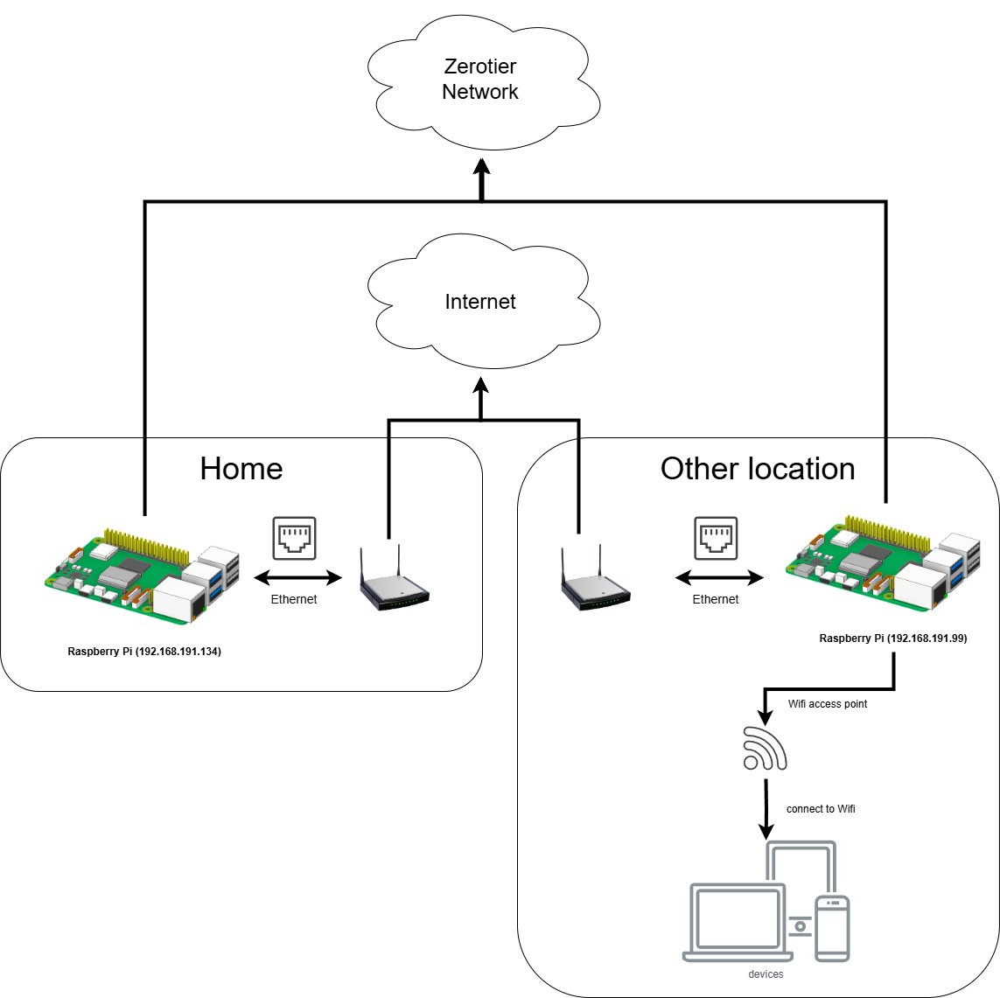
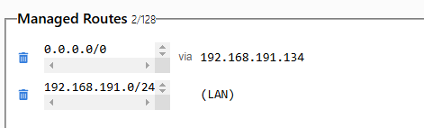

In this tutorial, we'll guide you through creating a simple, solution to route
all traffic through your home network using two Raspberry Pi devices and
ZeroTier. This setup allows you to securely connect to your home network from
anywhere and route all your internet traffic through your home network,
providing an extra layer of security and privacy. You will also get the same IP
address as you Home network from anywhere in the world. ZeroTier is a powerful
tool that allows you to create secure virtual networks, enabling your devices to
communicate as if they're on the same local network, regardless of their
physical locations.

**Note:** This tutorial is inspired by the [DigitalOcean
guide](https://www.digitalocean.com/community/tutorials/getting-started-software-defined-networking-creating-vpn-zerotier-one)
and [harivemula
guide](https://harivemula.com/2021/09/18/routing-all-traffic-through-home-with-zerotier-on-travel/).

## Prerequisites

Before we begin, ensure you have the following:

- Two Raspberry Pi devices with Raspberry Pi OS installed and updated. (I used
  two Raspberry Pi 3 devices with Raspberry Pi OS (64-bit, Kernel version: 6.6)
  for this tutorial.)
- Internet connectivity for both Raspberry Pi devices.
- A ZeroTier account. If you don't have one, you can create it for free at
  [ZeroTier Central](https://my.zerotier.com/).

## Overview of the Architecture



## Step 1: Set Up a ZeroTier Network

### Create a ZeroTier Account

1. Visit [ZeroTier Central](https://my.zerotier.com/) and sign up for a free
   account.

### Create a New Network

1. Once logged in, click on "Create A Network."
2. A new network will be created, and you'll be provided with a unique Network
   ID. Note this ID, as you'll need it later.

### Configure the Network

1. Click on your newly created network to access its settings.
2. Here, you can set a name for your network and adjust other settings as
   needed.
3. Ensure that "Private" is selected under "Access Control" to keep your network
   secure.

## Step 2: Install ZeroTier on the Raspberry Pi Devices

Perform the following steps on both Raspberry Pi devices.

### Install needed packages

1. Install the ZeroTier repository and its GPG key:

   ```bash
   curl https://raw.githubusercontent.com/zerotier/ZeroTierOne/master/doc/contact%40zerotier.com.gpg | gpg --dearmor | sudo tee /usr/share/keyrings/zerotierone-archive-keyring.gpg >/dev/null
   ```

   ```bash
   RELEASE=$(lsb_release -cs)
   ```

   ```bash
   echo "deb [signed-by=/usr/share/keyrings/zerotierone-archive-keyring.gpg] http://download.zerotier.com/debian/$RELEASE $RELEASE main" | sudo tee /etc/apt/sources.list.d/zerotier.list
   ```

   ```bash
   sudo apt update
   sudo apt install -y zerotier-one
   ```

2. Verify the Installation:

   ```bash
   sudo zerotier-cli status
   ```

   You should see an output indicating that ZeroTier is online.

3. Install additional packages:

   ```bash
   sudo apt install dnsmasq hostapd iptables dhcpcd5
   ```

   dnsmasq: A lightweight DNS and DHCP server.

   iptables: A tool for configuring the Linux kernel firewall.

   hostapd: A user space daemon for access point and authentication servers.
   (Only needed for the Travel Raspberry Pi for setting up a Wi-Fi access point)

   dhcpcd5: A DHCP (Dynamic Host Configuration Protocol Client Daemon) client
   and server. (Only needed for the Travel Raspberry Pi for setting up a static
   IP address)

## Step 3: Join your ZeroTier Network

1. Run the following command on each Raspberry Pi:

   ```bash
   sudo zerotier-cli join [Your_Network_ID]
   ```

   Replace `[Your_Network_ID]` with the Network ID you noted earlier.

2. Authorize the Devices:

   In ZeroTier Central, under your network's settings, scroll down to the
   "Members" section.

   You should see the Raspberry Pi devices listed as new devices. Check the
   "Auth?" box next to each device to authorize them on the network and click
   "Authorize" button.

   You can also rename the devices to make them easily identifiable.

3. Verify Connectivity:

   On each Raspberry Pi, list the networks to confirm they're connected:

   ```bash
   sudo zerotier-cli listnetworks
   ```

   You should see your network listed with the status "OK."

## Step 4: Test the VPN Connection

1. Obtain the ZeroTier IP Addresses: In ZeroTier Central, under the "Members"
   section, note the managed IP addresses assigned to each Raspberry Pi. If no
   IP address is assigned automatically, you can assign one manually. In this
   tutorial, we'll use the ZeroTier IP addresses `192.168.191.99` for the Travel
   Raspberry Pi and `192.168.191.134` for the Home Raspberry Pi.

   

2. Test Connectivity: You can join the same network on your local machine using
   the ZeroTier client and ping the Raspberry Pi devices to verify connectivity.

   ```bash
   ping [ZeroTier_IP_of_Raspberry_Pi]
   ```

   You should receive responses, indicating a successful VPN connection.

## Step 5: Configure Home Raspberry Pi

To configure the home Raspberry Pi to route all traffic through it, follow these
steps:

1. Enable IP Forwarding:

   - Open the sysctl configuration file:

      ```bash
      sudo nano /etc/sysctl.conf
      ```

   - Uncomment or add the following line to enable IP forwarding:

      ```plaintext
      net.ipv4.ip_forward=1
      net.ipv4.conf.all.rp_filter=2
      ```

   - Apply the changes:

      ```bash
      sudo sysctl -p
      ```

2. Configure `dnsmasq`:

   - Open the `dnsmasq` configuration file:

      ```bash
      sudo nano /etc/dnsmasq.conf
      ```

   - Add the following line to configure the DNS server:

      ```plaintext
      server=192.168.1.1
      ```

3. Configure `rc.local`:

   - Open the `rc.local` file:

      ```bash
      sudo nano /etc/rc.local
      ```

   - Add the following lines before the `exit 0` line to join the ZeroTier
     network and set up NAT:

      ```plaintext
      sudo zerotier-cli join [Your_Network_ID]
      sudo iptables -t nat -A POSTROUTING -o eth0 -j MASQUERADE
      sudo iptables -A FORWARD -m conntrack --ctstate RELATED,ESTABLISHED -j ACCEPT
      sudo iptables -A FORWARD -i ztc3qulcfx -o eth0 -j ACCEPT
      ```

      PS: The Home Raspberry Pi may also be connected to the internet via Wi-Fi.
      In this case, replace `eth0` with the interface name of the internet
      connection (e.g. `wlan0`).
   - Make `rc.local` file executable:

      ```bash
      sudo chmod +x /etc/rc.local
      ```

4. Configure ZeroTier Network Settings:

   - Open the ZeroTier network configuration file:

      ```bash
      sudo nano /var/lib/zerotier-one/networks.d/[Your_Network_ID].local.conf
      ```

   - Add the following lines to allow managed routes and global traffic:

      ```plaintext
      allowManaged=1
      allowGlobal=1
      allowDefault=1
      allowDNS=0
      ```

5. Reboot the Raspberry Pi:

   - Reboot the Raspberry Pi to apply all changes:

      ```bash
      sudo reboot
      ```


## Step 6: Configure Travel Raspberry Pi

This Raspberry Pi should be connected to the internet via Ethernet and will act
as a Wi-Fi access point for other devices. All traffic from the Wi-Fi clients
will be routed through the ZeroTier network and the Home Raspberry Pi. PS: If
you want to connect the Travel Raspberry Pi to the internet via Wi-Fi, you need
an additional USB Wi-Fi adapter. (not covered in this tutorial) To configure the
Travel Raspberry Pi, follow these steps:

1. Configure Static IP Address:

   - Open the DHCP client configuration file:

      ```bash
      sudo nano /etc/dhcpcd.conf
      ```

   - Add the following lines to set a static IP address for the `wlan0`
     interface:

      ```plaintext
      interface wlan0
      static ip_address=192.168.1.1/24
      nohook wpa_supplicant
      ```

2. Configure `dnsmasq`:

   - Open the `dnsmasq` configuration file:

      ```bash
      sudo nano /etc/dnsmasq.conf
      ```

   - Add the following lines to configure DHCP and DNS settings:

      ```plaintext
      interface=wlan0
      server=8.8.8.8
      server=8.8.4.4
      dhcp-range=192.168.1.2,192.168.1.200,255.255.255.0,24h
      ```

3. Enable wlan0:
   - Ensure wlan0 is unblocked:

      ```bash
      sudo rfkill unblock wlan
      sudo ifconfig wlan0 up
      ```

4. Configure `hostapd`:

   - Open the `hostapd` configuration file:

      ```bash
      sudo nano /etc/hostapd/hostapd.conf
      ```

   - Add the following lines to configure the Wi-Fi access point:

      ```plaintext
      country_code=DE
      interface=wlan0
      ssid=TESTWLAN
      channel=13
      auth_algs=1
      wpa=2
      wpa_passphrase=[passphrase]
      wpa_key_mgmt=WPA-PSK
      wpa_pairwise=TKIP CCMP
      rsn_pairwise=CCMP
      ```

      Change [passphrase] with your own password for the Wi-Fi access point. The
      Wi-Fi access point name used here is "TESTWLAN"
   - Set the correct permissions for the configuration file:

      ```bash
      sudo chmod 600 /etc/hostapd/hostapd.conf
      ```

   - Unmask, start and enable `hostapd`:

      ```bash
      sudo systemctl unmask hostapd
      sudo systemctl start hostapd
      sudo systemctl enable hostapd
      ```

   - Configure hostapd to run as a background service:

      ```bash
      sudo nano /etc/default/hostapd
      ```

      Add following lines:

      ```plaintext
      RUN_DAEMON=yes
      DAEMON_CONF="/etc/hostapd/hostapd.conf"
      ```

5. Enable IP Forwarding:

   - Open the sysctl configuration file:

      ```bash
      sudo nano /etc/sysctl.conf
      ```

   - Uncomment or add the following line to enable IP forwarding:

      ```plaintext
      net.ipv4.ip_forward=1
      ```

   - Apply the changes:

      ```bash
      sudo sysctl -p
      ```

6. Test that the Wi-Fi access point can be enabled:
   - Run following command

   ```bash
   sudo hostapd /etc/hostapd/hostapd.conf
   ```

7. Configure `rc.local`:

   - Open the `rc.local` file:

      ```bash
      sudo nano /etc/rc.local
      ```

   - Add the following lines before the `exit 0` line to join the ZeroTier
     network and start necessary services on boot:

      ```plaintext
      sudo rfkill unblock wlan
      sudo ifconfig wlan0 up
      sudo zerotier-cli join [Your_Network_ID]
      sudo systemctl start dhcpcd
      sudo iptables -t nat -A POSTROUTING -o ztc3qulcfx -j MASQUERADE
      sudo hostapd /etc/hostapd/hostapd.conf
      ```

      PS: Replace `ztc3qulcfx` with the interface name of the ZeroTier network.
   - Make `rc.local` file executable:

      ```bash
      sudo chmod +x /etc/rc.local
      ```

8. Configure ZeroTier Network Settings:

   - Open the ZeroTier network configuration file:

      ```bash
      sudo nano /var/lib/zerotier-one/networks.d/[Your_Network_ID].local.conf
      ```

   - Add the following lines to allow managed routes and global traffic:

      ```plaintext
      allowManaged=1
      allowGlobal=1
      allowDefault=1
      allowDNS=0
      ```

9. Reboot the Raspberry Pi:

   - Reboot the Raspberry Pi to apply all changes:

      ```bash
      sudo reboot
      ```

## Step 7: Configure ZeroTier Managed Routes

   You should now configure the ZeroTier managed routes to ensure that traffic
   is routed correctly between the Raspberry Pi devices. Following is my
   ZeroTier managed routes configuration:

   

- The IP address `192.168.191.134` is the ZeroTier IP address of the Travel
  Raspberry PI.
- 192.168.191.0/24 (LAN) is the ZeroTier server’s network.

## Step 8: Test the VPN connection

   To test the VPN connection, connect to the Wi-Fi access point of the Travel
   Raspberry Pi and try to access the internet. You should see that all traffic
   is routed through the Home Raspberry Pi. You can verify this by checking your
   public IP address, which should match the public IP address of the Home
   Raspberry Pi.

## Additional Considerations

- **Security:** Ensure that you have strong passwords and firewall rules in
  place to secure your network.
- **Performance:** The performance of your VPN may vary based on the Raspberry
  Pi model and network conditions.
- **Troubleshooting:** If you encounter issues, check the logs on both Raspberry
  Pi devices for error messages and investigate accordingly.
- **Desabling the VPN:** If you want to disable the VPN, you can simply stop the
  ZeroTier service on both Raspberry Pi devices:

     ```bash
     sudo systemctl stop zerotier-one
     ```

     You can also set allowDefault back to 0:

     ```bash
     sudo zerotier-cli set NetworkID allowDefault=0
     ```
